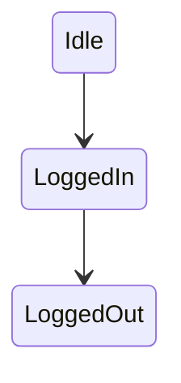

Ever seen a workflow pass QA, then fail the moment users retry, refresh, or hit a timeout? That gap usually isn’t about a “wrong input.” It’s often because the system is in a different state when the same input arrives. In state transition in software testing, the state decides what’s allowed, what must be blocked, and what should happen next.

It is one of the simplest ways to make these workflows behave predictably in the real world. Let’s explore how this works in more detail.

## **What is State Transition Testing?**

**State transition testing** is a [**black box testing**](https://keploy.io/docs/concepts/reference/glossary/black-box-testing/) technique that checks how an application behaves when it moves from one **state** to another because of an **event** (input or trigger).

Instead of testing one action in isolation, teams validate the workflow rules:

* Does the app move to the **correct next state**?
    
* Does it return the **correct output/action** for that move?
    
* Does it block **invalid transitions** cleanly?
    

That’s the core idea behind the **state transition testing technique** and why it’s widely used for workflows that depend on sequence and status.

**State Transition in Software Testing: Core Concepts**

To keep discussions clear across product, QA, and developers, teams usually align on four building blocks of [**software testing fundamentals**](https://keploy.io/blog/community/software-testing-basics): State, Event/Input, Transition, Action/Output.:

* **State:** where the system is right now (`LoggedOut`, `Processing`, `Locked`)
    
* **Event/Input:** what happens (`SubmitOTP`, `Cancel`, `Timeout`)
    
* **Transition**: the move from one state to another after an event
    
* **Action/Output**: what the system does/returns (UI message, API response, DB update)
    

Once these are named clearly, writing **test cases** becomes much less opinion-based.

A simple rule helps: if the same event behaves differently depending on “where we are,” it’s a strong candidate for **transition testing**.

## **Coverage Levels in Transition Testing**

Coverage can mean different things here, so it helps to pick a level based on risk and release impact.


### **State coverage and transition coverage**

* **State coverage**: reach each important state at least once
    
* **Transition coverage**: execute each important transition at least once
    

Most teams start with **transition coverage** because it directly validates movement through the workflow.

### **Sequence coverage (0-switch, 1-switch, n-switch)**

For higher-risk flows, teams test sequences:

* **0-switch**: single transition checks
    

***Example:***

```plaintext
LoggedOut → (CorrectPassword) → OTPPending → (CorrectOTP) → LoggedIn
```

This validates that one event causes the correct immediate state change.

* **1-switch**: two transitions back-to-back
    

***Example:***

```plaintext
LoggedOut → (CorrectPassword) → OTPPending → (CorrectOTP) → LoggedIn
```

This confirms that consecutive transitions behave correctly when chained.

* **n-switch**: longer sequences (used selectively because it grows fast)
    
    ***Example:***
    
    ```plaintext
    LoggedOut → (CorrectPassword) → OTPPending
    → (WrongOTP) → OTPPending
    → (WrongOTP) → OTPPending
    → (WrongOTP) → Locked
    ```
    

This matters in messy paths like: retry → timeout → retry → cancel, where real users often land.

## **State Transition Testing Technique: When to Use It**

State transition testing works best when behavior depends on status and sequence, not just input value.

Teams typically use it for:

* **Auth and security flows:** login, OTP, lockout, session expiry
    

Examples seen in real products:

```plaintext
GitHub-style login:
LoggedOut --(ValidCredentials)--> OTPPending --(ValidOTP)--> LoggedIn

Google-style OTP retry:
OTPPending --(WrongOTP xN)--> AccountLocked

AWS-style session expiry:
LoggedIn --(SessionTimeout)--> LoggedOut
```

* **Payments** (Stripe-style workflows): initiated, requires action, succeeded, failed, refunded
    
* **Orders** (Shopify-like lifecycles): created, paid, fulfilled, delivered, canceled
    
* **Subscriptions**: trial, active, past due, canceled
    
* **Workflow engines** (AWS Step Functions-like patterns): orchestrated steps with clear state movement
    

For mostly stateless CRUD, or when risk is mainly numeric limits, other techniques (like boundary testing) often give better ROI.

## **How to Perform State Transition Testing?**

Teams get the most value when the process stays structured, small, and reviewable.

### **1) Identify states that matter**

Start with states visible in:

* requirement docs and acceptance criteria
    
* API status fields
    
* UI labels like “Processing,” “Failed,” “Locked”
    


Keep it tight. A model that no one can review won’t help.

### 2)  **List events for each state**

Capture what can happen in each state, and who or what triggers it:

* **User actions (submit, retry, cancel)**  
    These are triggered directly by end users through the UI or API clients.  
    ***When they occur:*** during active interaction, often repeatedly (retries, edits, cancellations).  
    These events usually drive the most visible state changes and must be validated for both valid and invalid states.
    
* **System events (timeout, scheduled job)**  
    These are triggered by the application itself, without user involvement.  
    ***When they occur:*** after a time threshold (session expiry, payment timeout) or on a schedule (cleanup jobs, reconciliation tasks).  
    These transitions are common sources of “unexpected” state changes if not tested explicitly.
    
* **External events (webhook received, payment confirmation)**  
    These are triggered by third-party systems such as payment gateways, identity providers, or messaging services.  
    ***When they occur:*** asynchronously and often out of order, depending on network delays or retries.  
    These events are critical in distributed systems because they can arrive late, duplicate, or arrive after a user has already moved on.
    

### **3) Define valid and invalid transitions**

This is where [**workflow bugs**](https://keploy.io/blog/community/bug-bashing-guide) actually get caught.

For every transition, define:

* expected next state
    
* expected output/action
    
* expected side effect (or **no side effect** for invalid transitions)
    

Invalid transitions are common “production surprises,” like:

* Cancel after success
    
* Retry after `Locked`
    
* Pay twice for the same order
    
* Submit `SubmitOTP` when OTP was never requested
    

### **4) Convert transitions into test cases**

Turn each transition (and key sequences) into **state transition test cases** with clear assertions:

* response/output
    
* next state
    
* side effects (DB status, session, emitted event)
    
* no side effects on invalid moves
    

For API-heavy workflows, teams often reduce effort by replaying real traffic. This is where [**Keploy**](https://keploy.io/) can fit naturally: capturing real request/response flows once and replaying them helps validate stateful behavior without bloating test setup.

## **State Transition Diagram vs State Transition Table**


Both are useful, just for different moments in the workflow.

A **state transition diagram** is great for:

* quick alignment across teams
    
* spotting missing states and unclear rules
    

A **state transition table** is great for:

* [**generating test cases**](https://keploy.io/blog/community/test-case-generation-for-faster-api-testing) systematically
    
* tracking which transitions are already covered
    

In practice, teams often review the diagram together first, then use the table as the execution plan.

| Current State | Event | Next State | Valid |
| --- | --- | --- | --- |
| LoggedOut | Login | OTPPending | Yes |
| OTPPending | WrongOTP | OTPPending | Yes |
| OTPPending | WrongOTP x3 | Locked | Yes |
| Locked | Login | Locked | No |

## **Example of State Transition Testing**

A clean **example of state transition testing** is a login + OTP + lockout flow, because state changes control what’s allowed.

### **State transition diagram**



## **Test Cases Teams Usually Automate First**

To reach solid transition coverage:

* Happy path: correct password → correct OTP → logged in
    
* Lockout path: correct password → wrong OTP 3 times → locked
    
* Invalid action: attempt login while locked → still locked (no session created)
    

This is the real value: the bug stops looking “random” and starts looking like a broken transition rule.

## **State Transition Test Cases: Key Takeaways**

These are the points teams refer back to when planning coverage:

* **Transition coverage** is the best baseline for most products
    
* **Invalid transitions** need explicit assertions and **no side effects**
    
* Diagrams align people; tables ship **test cases**
    
* Start with high-risk workflows (auth, payments, orders)
    
* Keep models small to avoid state explosion
    

## **Advantages and Disadvantages of State Transition Testing**

This technique is powerful, but only when teams keep it scoped and clear.

### **Advantages**

* Strong for workflow-heavy features (auth, payments, orders, subscriptions)
    
* Makes negative testing natural (invalid transitions become explicit)
    
* Easier debugging (“wrong state after event”)
    
* A solid fit for **black box testing** because it focuses on behavior, not internal code
    

### **Disadvantages**

* **State explosion** if everything gets modeled at once
    
* Harder with async processing (timing affects transitions)
    
* Requires agreement on a “source of truth” state (UI vs API vs DB)
    

## **Benefits and Challenges for Modern Teams**

As products become more event-driven and async, state issues show up more often - especially across services. That’s why teams treat transition testing as a workflow safety net, not just another test type.


**Common benefits teams notice:**

* fewer [**workflow regressions**](https://keploy.io/blog/community/regression-testing-an-introductory-guide) that appear only after retries or timeouts
    
* clearer release confidence for stateful features
    
* better collaboration, because state rules become visible and reviewable
    

**Common challenges to plan for:**

* **State explosion**: too many states/transitions to maintain
    
* **Async behavior**: background jobs and webhooks can shift state unexpectedly
    
* **Conflicting states**: UI shows one thing while the backend still processes
    
* **Concurrency edges**: events arriving close together create rare transitions
    

A practical approach is to focus first on transitions tied to real user pain: charge failures, lockouts, stuck orders, and “can’t cancel” scenarios.

## **Best Practices for Transition Testing**

A state model only helps if it stays usable. The goal isn’t a perfect diagram. The goal is a model that produces reliable state transition [**test coverage**](https://keploy.io/blog/community/mastering-test-coverage-quality-over-quantity-in-software-testing) and prevents regressions.

Best practices that consistently work:

* Start with the highest-risk workflows (money, access, irreversible actions)
    
* Keep state names clear and defined (avoid vague “InProgress” states)
    
* Document invalid transitions explicitly (error + **no side effect**)
    
* Split big models into smaller ones by feature boundary
    
* Prefer transition coverage first, then add sequences only where risk is high
    
* Align across QA + developers + product before scaling the model
    
* Use deterministic replay where it helps (Keploy-style record/replay is useful for stateful APIs and reduces flakiness)
    

This keeps the **state transition testing technique** practical instead of turning into a diagram that nobody updates.

## **State Transition Diagram Tools (Text to Diagram)**

Diagrams get outdated fast when they live only in slide decks. Many teams prefer “diagram-as-text” because it stays close to documentation, is easy to review in PRs, and updates naturally as workflows evolve. These tools take text input and generate a **state transition diagram** without manual dragging and aligning.

* **Mermaid**: A great option for Markdown-first documentation. Teams can embed state diagrams directly into docs and keep explanations and visuals in one place.
    
* **PlantUML**: Fits well with diagram-as-code workflows. The source text can live in version control, and diagrams can be regenerated consistently across environments.
    
* **Graphviz (DOT)**: Useful when teams want more control over layout and rendering. It works well for generating clean SVG/PNG outputs for documentation.
    
* **State-machine-cat**: A lightweight option for generating readable state charts from a simple text definition. It’s handy when teams prefer a CLI-first workflow.
    

## **Conclusion**

State transition testing is one of the most practical ways to validate how products behave in real life - not just on the happy path, but under retries, timeouts, cancellations, and “wrong action at the wrong time” moments. When teams model states, events, and transitions clearly, **black box testing** becomes sharper, **test cases** become more systematic, and workflow regressions become easier to predict and prevent. Looking ahead, as systems become more event-driven and interconnected, state will only get harder to manage - and more important to validate. The question worth carrying into the next release cycle is simple: are workflows being tested as isolated steps, or as reliable state journeys that still hold up when real users don’t behave ideally?

## **FAQs**

### **1) Can state transition testing be used for API-only products?**

Yes, state transition testing assesses not only APIs but also the overall new state of the system (status fields, sessions, emitted events) as a result of an API call, regardless of whether a UI is present.

### **2) How do teams test transitions triggered by webhooks or background jobs?**

Both webhooks and completed jobs are considered events. They can be validated against their expected next state and side effects (including in the case of timeouts or retries) with targeted tests.

### **3) What’s a clean naming convention for states and events?**

All states and associated events should use stable, business-related identifiers. For example, states should be named PaymentCompleted, Account is Locked, and events should be named Confirm Payment, Timeout, and Submit OTP. This way, everyone can verify the state transition table effectively.

### **4) How do teams prioritize transitions when time is limited?**

Prioritize transitions that affect money, security, or irreversible actions before selecting the most common methods of failure per ticket: Retry, Cancel, Expire, Lockout.

### **5) How does the state transition testing technique help regression testing?**

The state transition testing approach establishes rules for behaviour as a result of given states and events, therefore allowing teams to look for regressions in behaviours - this makes regression testing easier to detect and communicate among teams.